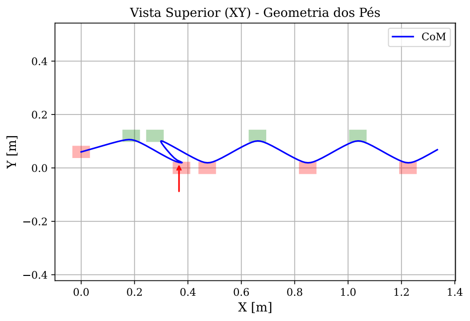

# Locomoção Bípede Baseada em ZMP 🤖👣

[](https://www.python.org/)
[](https://www.gnu.org/licenses/gpl-3.0)


Este repositório contém implementações em **Python** de algoritmos de controle para a locomoção de robôs humanoides. O código foi desenvolvido como parte do Trabalho de Conclusão de Curso em Engenharia Mecatrônica na Universidade Federal de Uberlândia (UFU).

O objetivo principal deste projeto é democratizar o acesso a técnicas de controle dinâmico de alto nível, fornecendo uma base de código modular e evolutiva. Este material foi pensado para auxiliar pesquisadores e membros de equipes de robótica no desenvolvimento de rotinas de caminhada robustas.

## 🚀 O Caminho da Evolução do Controle

O projeto utiliza o Modelo do Pêndulo Invertido Linear (LIPM) para desacoplar a dinâmica do Centro de Massa (CoM). Para fins didáticos e práticos, o repositório foi estruturado de forma evolutiva, demonstrando a transição do controle clássico até o preditivo autônomo. 

Estão disponíveis quatro implementações distintas:

1. **Preview Control Clássico (Kajita et al., 2003)**
   * Abordagem baseada em ganho ótimo de rastreamento para uma referência futura de ZMP.
   * Utiliza posições de passos estritamente pré-fixadas.

2. **Model Predictive Control (MPC) Analítico - Passos Fixos**
   * Formulação baseada no trabalho de Herdt, porém restrita a passos fixos.
   * **Sem uso de solvers numéricos:** A otimização da função de custo é resolvida analiticamente, derivando a função de custo. Excelente para entender a matemática pura por trás do horizonte preditivo.

3. **MPC Numérico sem Restrições - Passos Fixos**
   * Transição da solução analítica para a numérica utilizando o pacote de Programação Quadrática (QP).
   * Mantém os passos fixos e não aplica matrizes de restrição.

4. **MPC com Posicionamento Automático de Passos (Herdt / Maximo)**
   * A solução mais avançada e robusta do repositório.
   * Utiliza o solver `cvxopt` para resolver o QP sujeitando o sistema a restrições rigorosas.
   * **Autonomia:** Eleva as posições futuras dos pés a variáveis de decisão do otimizador. O robô recalcula onde pisar em tempo real para rejeitar perturbações externas e manter o equilíbrio dinâmico.

*Nota:* O documento do TCC que acompanha este projeto foca na comparação direta entre os extremos evolutivos: o método de Kajita (1) e o MPC com Posicionamento Automático (4).

## ⚙️ Instalação e Configuração

Como este projeto foi estruturado utilizando **Jupyter Notebooks**, você possui duas opções para executar as simulações: rodar diretamente na nuvem (sem necessidade de instalação) ou rodar localmente na sua máquina.

### Opção 1: Nuvem (Google Colab) - Recomendado
Não é necessária nenhuma instalação. Basta subir os arquivos `.ipynb` da pasta `notebooks/` para o seu Google Drive e abri-los com o Google Colab.
* *Atenção:* O Colab já possui o `numpy` e o `matplotlib` instalados por padrão, mas você precisará adicionar um bloco de código no início do notebook do MPC com o comando `!pip install cvxopt` para instalar o solver.

### Opção 2: Localmente
Clone o repositório para a sua máquina:
```bash
git clone https://github.com/Paulo-Botelho/TCC_preview_control.git
cd TCC_preview_control
```
Crie um ambiente virtual (opcional, mas recomendado) e instale as dependências:
```bash
pip install -r requirements.txt
```
## 💻 Como Usar

O projeto disponibiliza os algoritmos em dois formatos de execução.

### 1. Via Terminal (Scripts Python)
Ideal para executar as simulações rapidamente ou para importar as classes do controlador para o software de um robô físico. Os arquivos estão localizados na pasta `src/`.

Para rodar, basta executar os scripts diretamente pelo terminal:
```bash
# 1. Simulação Clássica de Kajita
python src/01_kajita_preview_control.py

# 2. Simulação MPC Analítico
python src/02_mpc_analitico_passos_fixos.py

# 3. Simulação MPC Numérico (Sem Restrições)
python src/03_mpc_numerico_simples.py

# 4. Simulação MPC Completo (Posicionamento Automático e Restrições)
python src/04_mpc_passos_automaticos.py
```

### 2. Ambiente Interativo (Jupyter Notebooks)
Ideal para explorar a matemática, alterar parâmetros e visualizar os gráficos passo a passo de forma interativa. Os arquivos estão na pasta `notebooks/`.

Para utilizar:
1. Inicie o ambiente rodando `jupyter lab` no terminal (ou abra via Drive).
2. Na seção de **Configuração de Parâmetros** de cada notebook, você pode alterar livremente variáveis como `T_step` (tempo da passada), velocidade de referência e ativar/desativar a variável `empurrao` para testar a rejeição a distúrbios.
3. Execute as células sequencialmente para ver a mágica acontecer.

## 📊 Visualização de Resultados

Todos os scripts contam com a geração automatizada de gráficos de alta qualidade, detalhando:
* Trajetória do CoM e ZMP (eixos frontal e lateral).
* Sinal de controle exigido (Jerk).
* Vista superior demonstrando a geometria dos pés e o polígono de suporte.

## 📄 Licença

Este projeto é licenciado sob a **GNU General Public License v3.0** (GPLv3). 
Isso significa que você é livre para usar, modificar e distribuir este software, desde que qualquer trabalho derivado (seja um novo código ou a integração em um robô físico) também seja de código aberto e distribuído sob a mesma licença.


## 📚 Como Citar

Se este repositório foi útil para a sua pesquisa ou equipe de robótica, por favor, considere citar o documento original do TCC:

```bibtex
@monography{botelho2026zmp,
  title={Implementação de controle preditivo para definição da posição dos pés de um robô humanoide ao longo da caminhada},
  author={Botelho, Paulo},
  school={Universidade Federal de Uberlândia (UFU)},
  year={2026},
  type={Trabalho de Conclusão de Curso (Engenharia Mecatrônica)}
}